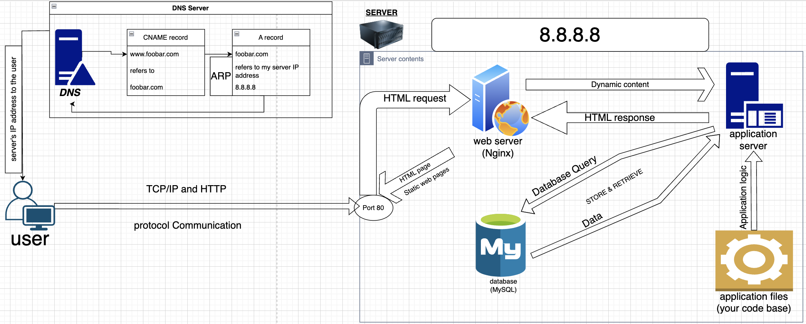

# Task 0: Simple Web Stack

- [BACK](./README.md)
- [NEXT](./1-distributed_web_infrastructure.md)

## Design Overview

1. **Server:**
   - **Role:** The server acts as the foundation, whether it's a tangible piece of hardware or a virtual entity, responsible for hosting the entire web infrastructure.
   - **Communication:** It uses the IP address 8.8.8.8 to establish a connection with the user's device.

2. **Web Server (Nginx):**
   - **Role:** Nginx comes into play, handling incoming HTTP requests and delivering static content.
   - **Communication:** Listens attentively on port 80 (HTTP) and engages with the user's device via their web browser.

3. **Application Server:**
   - **Role:** The application server takes center stage, executing application logic and handling dynamic content.
   - **Communication:** Collaborates closely with the web server to process dynamic content before crafting responses back to the user.

4. **Application Files (Code Base):**
   - **Role:** The codebase holds the website's essence, housing HTML, CSS, and the magic behind server-side scripts.

5. **Database (MySQL):**
   - **Role:** The database takes on the crucial task of storing and managing the website's data.
   - **Communication:** The application server engages in a dialogue with the database, fetching and storing essential data.

6. **Domain Name:**
   - **Role:** Foobar.com is configured with a www record, serving as a friendly pointer to the server's IP (8.8.8.8).

## Insightful Explanations

- **Server Significance:** This powerhouse hosts the entire ensemble of web components.
  
- **Domain Name Impact:** The domain name is a readable guide, directing users to the server's IP.

- **DNS Record Clarity:** The www record involves a bit of DNS magic, acting as a companion to the main domain.

- **Web Server Functionality:** Nginx's role is to field HTTP requests and gracefully deliver static content.

- **Application Server Magic:** This server thinks on its feet, executing the application's intricate logic for dynamic content.

- **Database Backbone:** The database is the backstage hero, storing and managing all the critical data.

- **Communication Dynamics:** A symphony of HTTP protocol enables smooth communication between the user's device and the server, all happening over the underlying TCP/IP network.

## Recognizing Challenges

1. **SPOF Awareness:** The server is a singular point of failure; if it goes down, the entire website experiences a temporary blackout.
  
2. **Maintenance Downtime:** Deploying fresh code or tinkering with the web server may cause brief website downtime.

3. **Scaling Hurdles:** Handling increased traffic poses a challenge for this setup.

## Diagram

Diagram link: [Distributed Web Infrastructure Diagram](https://drive.google.com/file/d/10hQtH_4ue4LzsZpVjHjUcrBLmKdj61Wg/view?usp=sharing)

---
## Personal Note

This tailored solution aims to reflect a distinctive style while maintaining clarity and completeness. If there are specific nuances you'd like to incorporate or further details you'd like to emphasize, feel free to let me know!

- [BACK](0x09-web_infrastructure_design/README.md)
- [NEXT](./1-distributed_web_infrastructure)

