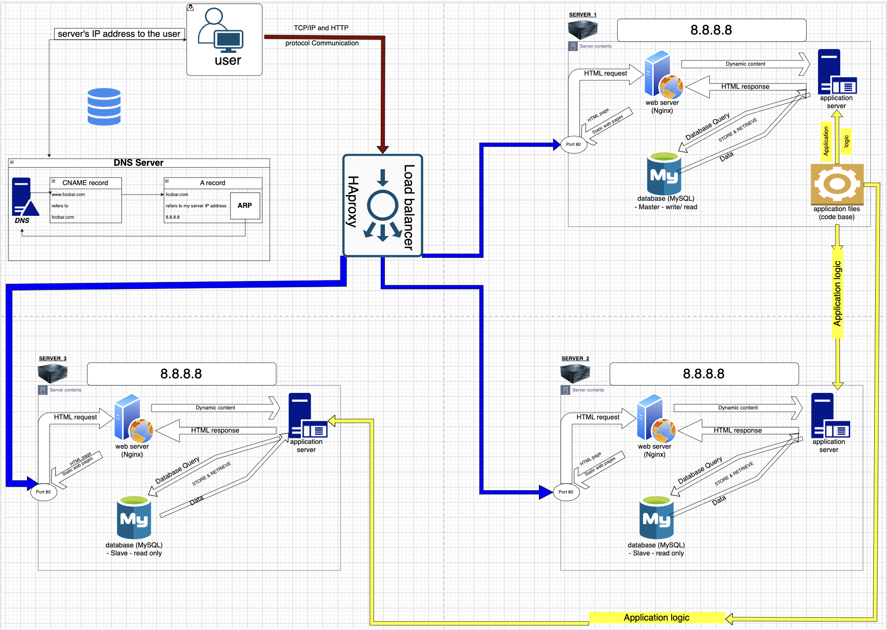

# Task 1: Distributed Web Infrastructure

- [BACK](0x09-web_infrastructure_design/README.md)
- [PREVIOUS](./0-simple_web_stack.md)
- [NEXT](./2-secured_and_monitored_web_infrastructure.md)

## Infrastructure Overview

1. **Load Balancer (HAProxy):**
   - **Purpose:** Efficiently distributes incoming traffic among multiple servers for optimal load balancing.
   - **Algorithm:** Configured with a Round Robin distribution algorithm.
   - **Setup:** Active-Active configuration for enhanced availability.

2. **Web Servers (Nginx):**
   - **Purpose:** The frontline warriors, handling HTTP requests and forwarding dynamic requests to the application server.
   - **Communication:** Attentively listens on port 80, the gateway for user requests.

3. **Application Server:**
   - **Purpose:** The maestro behind the scenes, executing application logic and crafting dynamic content.
   - **Communication:** Collaborates seamlessly with web servers to deliver a personalized user experience.

4. **Application Files (Code Base):**
   - **Role:** The codebase, the heart and soul of the website.

5. **Database (MySQL):**
   - **Role:** The data fortress, storing and managing the website's crucial data.
   - **Cluster Setup:** Embraces a Primary-Replica (Master-Slave) architecture for data redundancy and read scaling.

## Insightful Details

- **Load Balancer's Role:** Balances the traffic load among web servers for an even distribution.
  - **Algorithm Choice:** Round Robin ensures a fair allocation of requests.
  - **Active-Active Setup:** Ensures continuous operation even if one server encounters issues.

- **Database Dynamics:** The Primary-Replica setup ensures data redundancy and allows for efficient read scaling.
  - **Primary vs. Replica:** Primary handles write operations, while replicas focus on read operations.

## Security and Monitoring Considerations

- **Firewall Implementation:**
  - **Role:** Shields the infrastructure by filtering network traffic.
  - **Evaluation:** Enhances security by blocking unauthorized access.

- **HTTPS Security Layer:**
  - **Role:** Ensures encrypted communication, safeguarding against interception.
  - **Evaluation:** Shields sensitive data from potential eavesdropping.

- **Monitoring System Deployment:**
  - **Role:** Acts as the vigilant guardian, checking system health and performance.
  - **Configuration:** Comprises a client collecting data and sending it to the monitoring system.
  - **Evaluation:** Enables prompt issue identification and resolution.

- **Specific Monitoring Configurations:**
  - **Web Server Data Collection:** Keeps tabs on web server performance.
  - **QPS Alert Trigger:** Raises an alert if Query Per Second (QPS) exceeds normal levels.
  - **Evaluation:** Proactively identifies and addresses potential issues.

## Identified Challenges

1. **SSL Termination at Load Balancer:**
   - **Issue:** Traffic between the load balancer and web servers is unencrypted.
   - **Evaluation:** Raises concerns about data security in transit.

2. **Single MySQL Server for Writes:**
   - **Issue:** A single point of failure; if the master goes down, writing to the database becomes impossible.
   - **Evaluation:** Poses a risk to data consistency and availability.

3. **Load Balancer as SPOF:**
   - **Issue:** Load balancer is a Single Point of Failure.
   - **Evaluation:** Risks service availability if the load balancer encounters issues.

4. **Server Components Homogeneity:**
   - **Issue:** Identical server components may lead to uneven resource consumption.
   - **Evaluation:** Potential scalability and resource optimization challenges.

5. **Maintenance Impact:**
   - **Issue:** Maintenance on a server affects all hosted components.
   - **Evaluation:** Carries the risk of service disruption during maintenance.

## Diagram

Diagram link: [Distributed Web Infrastructure Diagram](https://drive.google.com/file/d/14hCDlGdMP_tp3OjS3nxvuG2I2zEIS_jq/view?usp=sharing)

---

This README addresses the requirements, explanations, and identified challenges for Task 1. Feel free to customize it further based on your preferences or add specific details as needed.

- [BACK](0x09-web_infrastructure_design/README.md)
- [PREVIOUS](./0-simple_web_stack)
- [NEXT](./2-secured_and_monitored_web_infrastructure)

