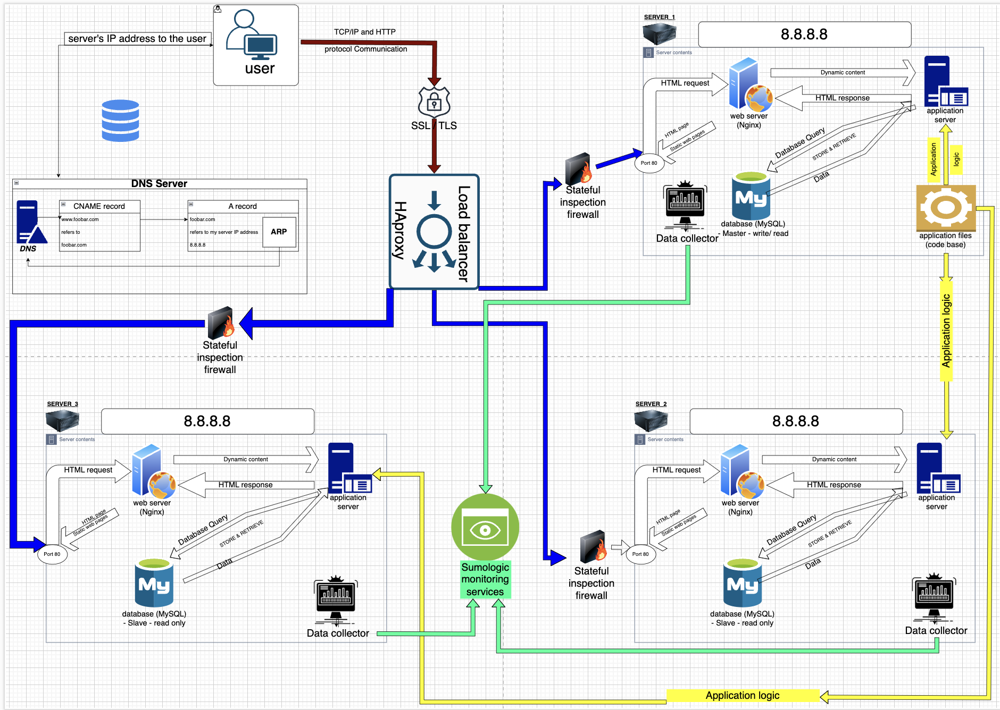

# Task 2: Secured and Monitored Web Setup

- [BACK](0x09-web_infrastructure_design/README.md)
- [PREVIOUS](./1-distributed_web_infrastructure.md)
- [NEXT](./3-scale_up.md)

## The Secure Setup

1. **SSL-Enabled Load Balancer:**
   - **Mission:** Routes incoming traffic across servers while keeping it secure.
   - **Concern Addressed:** Avoids potential data exposure by not terminating SSL at the load balancer.

2. **Guardian Web Servers (Nginx):**
   - **Objective:** Handles HTTP requests and directs dynamic content to the application server.
   - **Security Ensemble:** Uses HTTPS to ensure encrypted communication, preserving data integrity for user-server interactions.

3. **Application Maestro:**
   - **Task:** Conducting the orchestra of application logic and dynamic content.
   - **Security Harmony:** In tandem with web servers, it sustains encrypted communication, ensuring a secure and seamless user experience.

4. **Code Base Sanctum:**
   - **Essence:** The core of the website, housing HTML, CSS, and server-side scripts.

5. **MySQL Citadel (Primary-Replica Fortification):**
   - **Role:** The data powerhouse fortified in a Primary-Replica setup.
   - **Write Fortification:** Multiple servers ready to accept writes guard against a single point of failure.

6. **Firewall Guardians (3):**
   - **Mission:** Vigilant gatekeepers, filtering inbound and outbound traffic.
   - **Evaluation:** Shields against unauthorized access, enhancing overall security.

7. **Monitoring Agents (Sumologic Data Scouts - 3):**
   - **Role:** Silent observers, collecting intel and relaying it to the monitoring system.
   - **Surveillance Specifics:** Configured to track web server performance and raise alarms if QPS reaches concerning levels.

## Decrypting the Why Behind Choices

- **Firewall's Shielding Aura:** Adds a layer of security to control the ebb and flow of network traffic.
  - **Security Essence:** Mitigates unauthorized access, standing guard against potential security threats.

- **HTTPS: The Secret Language of Trust:**
  - **Encoded Traffic:** Serving traffic over HTTPS ensures intercepted traffic remains an enigma.
  - **Data Integrity Assurance:** Preserving the sanctity of exchanged data between users and servers.

- **Monitoring's Vigilant Gaze:**
  - **Issue Sentry:** Used to unearth potential issues and expedite solutions.
  - **Performance Barometer:** Tracks web server data, ready to sound the alarm if QPS becomes a performance tightrope.

- **Monitoring Tool Data Siphoning:**
  - **Agent in Action:** Acting as a data collector, capturing performance metrics and ferrying them to the monitoring system.
  - **Evaluation:** Provides real-time insight into the infrastructure's health and performance.

- **QPS Surveillance Maneuver:**
  - **Configuration:** Set to trigger an alert if the Query Per Second (QPS) surpasses predefined thresholds.
  - **Evaluation:** Proactively identifies potential bottlenecks and capacity overload situations.

## Challenges in the Battlefield

1. **SSL Termination's Achilles Heel:**
   - **Issue:** Unencrypted traffic between the load balancer and web servers.
   - **Evaluation:** Raises security concerns due to potential data exposure.

2. **Single MySQL Write Guardian:**
   - **Issue:** A solo sentinel for writes; if the master falters, writing to the database grinds to a halt.
   - **Evaluation:** Poses a risk to data consistency and availability.

3. **Homogeneity Hurdle for Server Components:**
   - **Issue:** Identical components may lead to uneven resource consumption.
   - **Evaluation:** Potential scalability and resource optimization challenges lurk in the shadows.

## Encrypted Chronicle Diagram

[Secured and Monitored Web Infrastructure Diagram](https://drive.google.com/file/d/139sBKCr1ElNCjdjrNmCiu8I8BivdO8VP/view?usp=sharing)

- [BACK](0x09-web_infrastructure_design/README.md)
- [PREVIOUS](./1-distributed_web_infrastructure)
- [NEXT](./3-scale_up)

