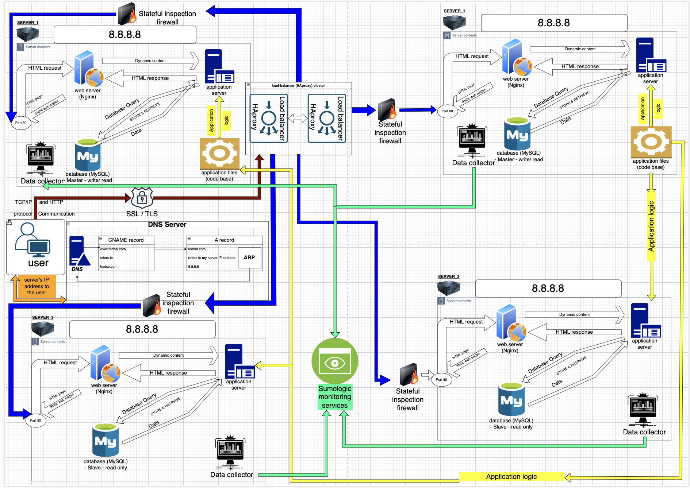

# Task 3: Scaling Up - Advanced Readme

- [BACK](./README.md)
- [PREVIOUS](./2-secured_and_monitored_web_infrastructure.md)

## Architectural Ascent

### Components in the Spotlight:

1. **Server Extraordinaire:**
   - **Mission:** Central hub for managing web, application, and database components.
   - **Advanced Move:** Positioned to handle increased loads and orchestrate the growing symphony of web, application, and database components.

2. **HAproxy Load-Balancer Duo:**
   - **Strategic Deployment:** Configured as a cluster, forming a resilient tandem.
   - **Cluster Configuration Rationale:** Ensures high availability; if one load balancer faces issues, the other seamlessly takes the lead.

### Understanding the Choices:

- **Server Prowess:**
  - **Rationale:** Acts as the core facilitator for scaling up components.
  - **Scaling Symphony:** Equipped to manage increased loads and balance the growing demands.

- **HAproxy Load-Balancer Tandem:**
  - **Strategic Move:** Configured as a cluster to fortify against downtime and enhance availability.
  - **Continuous Operations:** Ensures uninterrupted service even in the face of load balancer hiccups.

- **SSL/TLS Termination at Load Balancer:**
  - **Encryption Handling:** SSL/TLS encryption is terminated at the load balancer.
  - **Advantages:** Simplifies certificate management, improving efficiency and easing maintenance.
  - **User Interaction:** The user's browser establishes an encrypted connection with the load balancer.
  
- **Communication with Servers:**
  - **Decryption at Load Balancer:** The load balancer decrypts incoming traffic, processes it, and forwards requests to the servers over an unencrypted connection.
  - **Communication Details:** The interaction between the load balancer and the servers occurs without SSL/TLS encryption.

### Architectural Symphony Diagram

[Scaling Up - Advanced Architecture Diagram](https://drive.google.com/file/d/1cdgTtnwqitzcf7AQYvqEBDFhltLjc0zO/view?usp=sharing)

---

This advanced documentation outlines the strategic scaling of components, featuring an additional server and a load balancer duo configured as a resilient cluster. The architecture is primed for increased loads, ensures uninterrupted service, highlights SSL/TLS termination at the load balancer, and emphasizes communication with the servers without SSL/TLS encryption. A diagram link is provided in the repository, capturing the essence of the advanced scaling approach.

- [BACK](0x09-web_infrastructure_design/README.md)
- [PREVIOUS](./2-secured_and_monitored_web_infrastructure)

